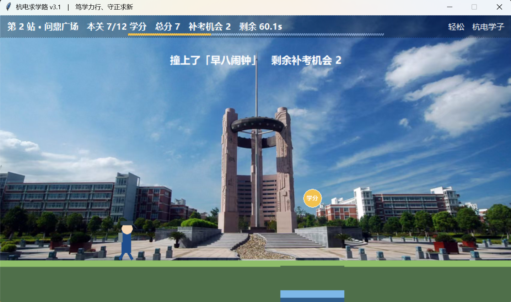
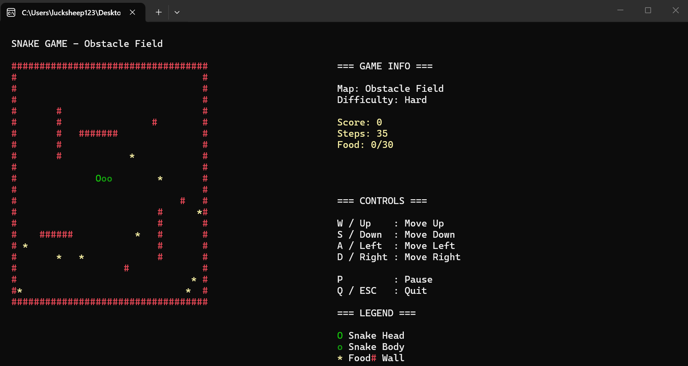

# small-program

一些小项目。三个都是自己从想法一路做到能跑的：**玩法与手感、边界条件、验收标准我来定，
具体实现大量借助 AI 工具**，每一轮都先跑起来、不好用就回去改。

| # | 项目 | 技术栈 | 一句话 |
|---|------|--------|--------|
| 01 | [杭电求学路 · 横板跑酷](#01-杭电求学路--横板跑酷) | Python · tkinter | 把「杭电学生的一天」做成跑酷，998 行、零第三方依赖 |
| 02 | [彩票中奖检测系统](#02-超级大乐透中奖检测系统) | Python · tkinter | 自动拉最新一期大乐透开奖号，判定九个奖级 |
| 03 | [贪吃蛇](#03-贪吃蛇) | C++ · 控制台 | 四张地图、无尽模式三档速度、得分越高越快 |

---

## 01 杭电求学路 · 横板跑酷



五个校区地标对应从晨光到晚课的五个时段 —— 南大门（晨光启程）、问鼎广场（早八冲刺）、
风雨操场（体测拼搏）、寝室楼（午后小憩）、梅花餐厅（晚饭冲刺）。障碍都是学生日常：
早八闹钟、实验报告 DDL、体测跨栏，还有一个必须滑铲才能过的涵洞低杆；道具是学分、奖牌和
offer；终点埋了一枚要解**恺撒密码**的校徽彩蛋。

**怎么跑**

```bash
cd 杭电求学路——横板跑酷/游戏程序
python 杭电求学路.py
```

零第三方依赖，只用标准库。`背景图/` 和 `地图底图.png` 是程序运行时找的素材，
所以要切到 `游戏程序` 目录里跑（或者保持这些文件和 `.py` 同级）。
存档写在同目录的 `hdu_save.dat`。

**动手时踩到的坑**

- 物理量整体放大 1.3 倍之后，跳高和跳距要同步放大，否则原本能过的断桥会变成死关 ——
  所以关卡里留了一套可达性校验，改重力/起跳速度之后先跑一遍再谈手感。
- `after()` 的心跳间隔拿到的 `dt` 会跳变（切后台再回来能差出好几秒），
  必须夹一个上限，不然角色会一步穿过障碍物。
- 碰撞要按子步进拆开算：一帧位移超过障碍物宽度时，整段位移只判一次头和尾就会漏判。

---

## 02 超级大乐透 中奖检测系统


打开就自动从体彩官方接口拉最新一期开奖号；没网、或接口抽风，就退回内置号码，
并在界面上写清楚现在用的是哪一期 —— **网络问题不该让程序崩**。

判定不看号码顺序、只数命中个数，所以九个奖级写成一张表来查，而不是堆一长串 `if`。
判定逻辑单独抽成 `check_prize()`，和界面完全分开，不开窗口也能测。

**怎么跑**

```bash
cd 彩票中奖检测系统
python 彩票中奖检测系统.py     # 想强制用手动号码：把文件里的 AUTO_FETCH 改成 False
python 测试_中奖判定.py        # 穷举 18 种命中组合，逐条对着规则核
```

`requests` 是可选的：装了就联网取号，没装就自动降级成手动模式，不影响程序运行。

**动手时踩到的坑**

- 前区和后区是**两个独立的号池**，跨区重号是合法的（开奖号自己就是前区 09、后区 09），
  所以查重复只能在各自区内查。
- 「只看中几个、不看顺序」意味着不该用一串分支去描述规则，查表更短也更好验。

---

## 03 贪吃蛇



控制台贪吃蛇：四张地图、无尽模式三档速度，得分越高蛇走得越快。
仓库里从 `snake_game.cpp` 到 `snake_game_plus2.cpp` 一共四个版本，是**一版一版改出来的过程**。

**怎么编译**

```bash
cd 贪吃蛇
g++ snake_game_plus2.cpp -o snake.exe -std=c++17
./snake.exe
```

只用 `conio.h` / `windows.h`，Windows 下 g++ 直接编。

**动手时踩到的坑**

- 控制台字符**高约是宽的两倍**，纵向移动不单独补一档延时的话，蛇斜着走会看着忽快忽慢 ——
  所以横纵向用了两套延时参数。
- 前两版的地图有连通性问题：迷宫画得好看，但蛇进去就出不来。后面几版把地图改成开放式，
  并把出生点统一挪到 (3, 3)。

---

## 关于这套做法

三个项目都不是「照着教程敲一遍」。流程一直是同一个：

1. 先把想法拆成一条条能验收的需求（跳跃高度多少、联网失败怎么办、地图要不要连通）；
2. 把需求交给 AI 落成代码；
3. **在真机上跑**，跑不通就回去改 —— 上面那些坑，基本都是这一步才暴露出来的。

所以这个仓库里真正想展示的不是「会调 API」，而是：**能把一个模糊的想法变成能跑的东西，
并且每一轮都知道下一步该改哪里。**
